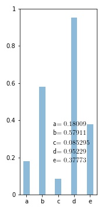
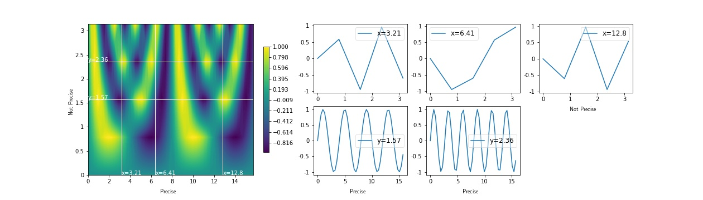
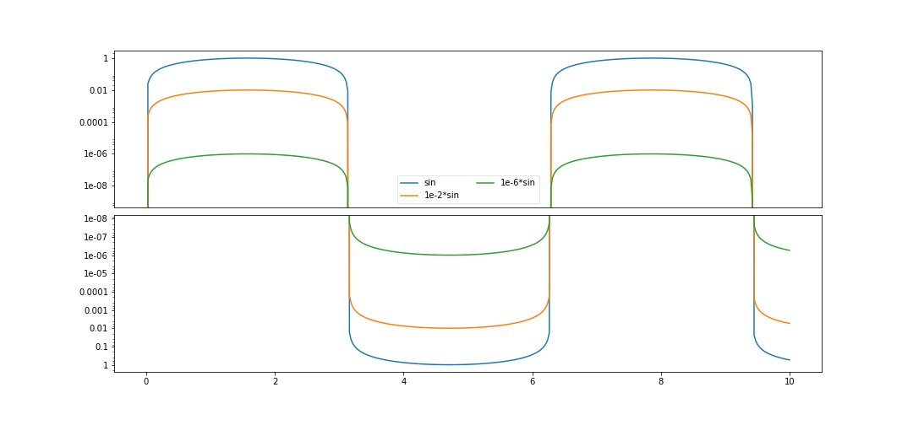
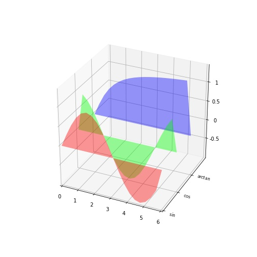
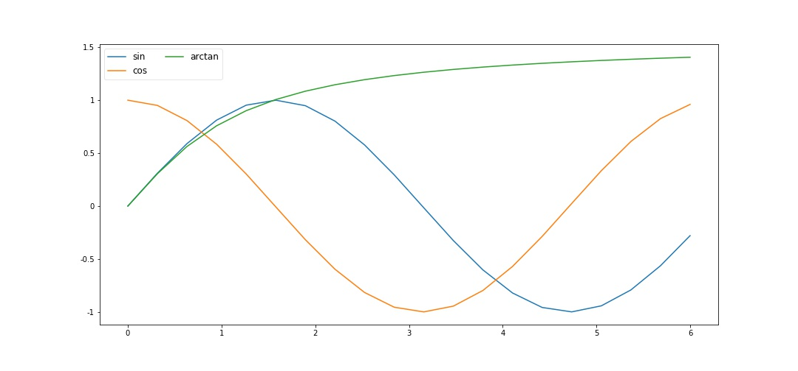
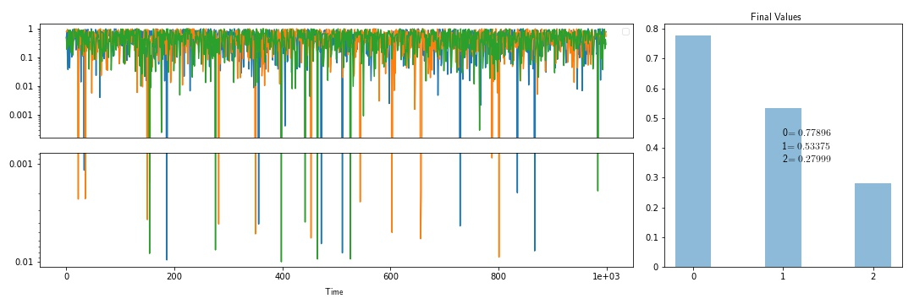
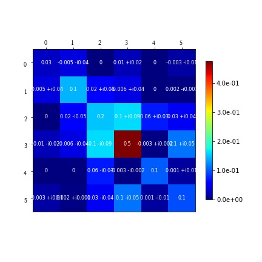

# Python-Tools
Python functions for plotting and saving data. Most important: Plotting large Matrices to quickly recognize important elements. It also wraps 2d and 3d Plotting such that they have common input functionlist parameters.

* Latex Support by default
* easy pdf  export
* multipage pdf support

## Plot Wrappers

